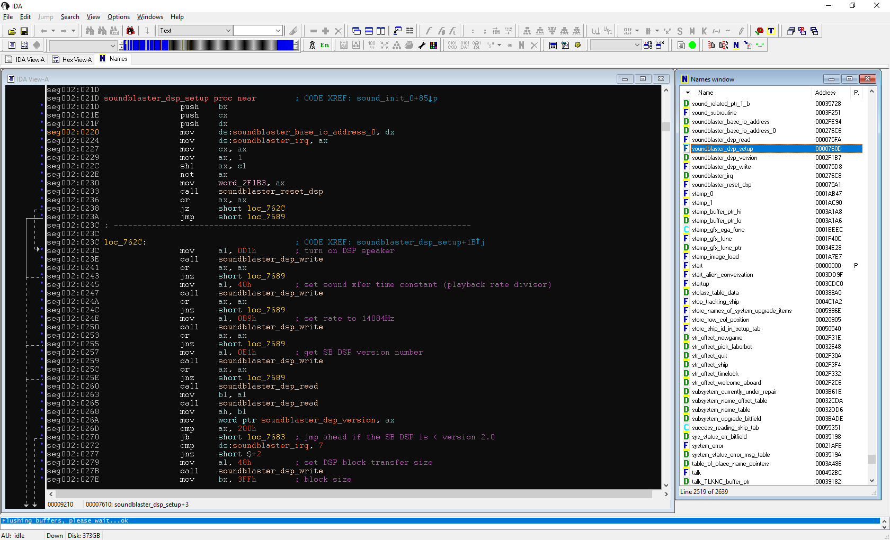

# Nomad reverse engineering

This repository contains an IDA database that documents the functions and data structures used by the 1993 space exploration game *Nomad*. This game was not commercially successful, and quickly fell into obscurity after its release. Many details of its development are likely lost. This project attempts to identify and preserve as much information as can be discerned through analysis of the main executable and the data archives.

## Tools

The initial disassembly was done with IDA Freeware 5.0, obtained via the [ScummVM project hosting](https://www.scummvm.org/news/20180331/). This version of IDA is generally regarded as ideal for DOS-era MZ executables, as support for the MZ format was dropped in version 6.0. However, it is possible to import version 5 databases into IDA 6.x, from where they can be saved and then imported into IDA 7.x. This repo currently contains two versions of the IDA database: ``nomad_ida400.idb`` for the older version that is used by IDA through version 5.x, and ``nomad_ida700.idb`` for IDA 7.x. At the moment, they are in sync. I'm hoping that we can eventually transition to an open-source analysis tool such as Ghidra (see below). Note that opening an IDB database requires a **32-bit** IDA. The 64-bit builds don't recognize the IDB format.

Additionally, this repo contains an XML representation of the database (``nomad_ghidra.xml``), generated with the help of IDA plugins provided by the [Ghidra](https://github.com/NationalSecurityAgency/ghidra) project. This file is intended to provide a means to migrate from IDA to Ghidra, and can be imported into the latter.

## Executable layout and function categories

The many functions in the game's executable can be organized into the categories listed below. Note that *Nomad* does not use a 32-bit DOS extender, instead relying on the "FBOV" overlay mechanism provided by the Borland compiler suite.

 - Borland C/C++ FBOV overlay management
 - Extended memory manager detection / operation
 - Configuration file parsing
 - Internal buffer management
 - Archive file library functions (reading, decompressing .DAT contents)
 - Game saving/loading
 - Main executive loop
 - Sound support
   - Decompressing stored DPCM data
   - Sound Blaster DSP setup, DMA configuration, and PCM data buffer management
   - Disney Sound Source / Covox Speech Thing setup
 - Switchable VGA/EGA support
 - User input processing
     - Keyboard scan code to character mapping
     - Mouse position filtering
     - Cursor drawing
 - Graphics operations
   - Palette loading, writing to VGA, fading, cycling
   - Basic geometric drawing (points, lines, arcs, rectangles, ellipses, circles)
   - Font loading and drawing
     - String width/height computation based on glyph size
   - Stamp image (.STP) loading, decoding, and display
   - Delta animation frame (.DEL) loading, decoding, and display
   - 3D ship model loading and processing
   - Rendering elements to node buffer entries
     - Backdrop image
     - Starfield background
     - Point particles for planet approach
     - Texture-mapped planet
     - Combat flight point particles
     - Combat sprites (shield strikes and explosions)
     - 3D ship models
     - Window/dialog boxes
   - Damage effects (screen cracking, color flash)
   - Rendering node buffer content to video RAM
   - Fractal planet terrain drawing
 - Window and dialog boxes
   - Widget drawing and behavior logic
     - Checkbox, list box, pushbutton, radio button, spin button, text area, text box, text editor
     - Navigation starmap
     - Radar/PPI scope
   - Routing user input to controls
   - Focusing/defocusing, enabling/disabling, tab order
 - Cinematic/cutscene sequences
   - Full-screen raw VGA image display
   - Scripted 3D ship flight (e.g. labor bot deployment, trading sequence)
 - Demo recording (unused)
 - Game mechanics
   - Alien conversation
   - Alien ship behavior for flight and combat
   - Alien temperament management
   - Alliance mission handling/tracking
   - Combat actions
     - Player free flight
     - Missile loading and targeting
     - Missile homing and hit detection
     - Ship system damage
   - Data table lookup for characteristics of aliens, ships, planets, and items
   - Labor bot management
   - Losten gateway operations
   - Rendering of game text ("rtext") and processing embedded triggers
   - Player's ship system upgrades
   - Ship and planet scanning
   - Trading items
   - Miscellaneous periodic service routines
     - Enemy missile store replenishment
     - Labor bot harvesting
     - Ship system repair

